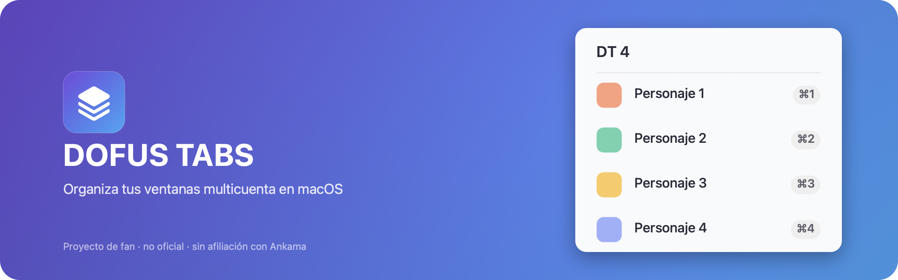

# Dofus Tabs (macOS)



[](LICENSE)


<a href="https://buymeacoffee.com/martiferretc" target="_blank"></a>

**[Sitio web](https://dofus-tabs-macos.vercel.app/)** · **[Descargar última release](../../releases/latest)**

Organizador de ventanas multicuenta para Dofus, nativo de macOS. Proyecto de fan, sin afiliación con Ankama — ver la investigación de mercado y las decisiones de arquitectura en [research/market-research.md](research/market-research.md).

## Descargar e instalar

1. Descarga el `.zip` de la [última release](../../releases/latest) y descomprímelo.
2. Arrastra `DofusTabs.app` a tu carpeta `/Applications` (opcional, pero recomendado).
3. **Primer arranque:** la app no está firmada con un certificado de pago de Apple (Developer ID), así que macOS la bloqueará con un aviso de "desarrollador no identificado". Para abrirla la primera vez: clic derecho (o Ctrl+clic) sobre `DofusTabs.app` → **Abrir** → confirmar en el diálogo. Solo hace falta esta vez; a partir de ahí abre normal con doble clic.
4. Al arrancar, macOS pedirá permiso de **Accesibilidad** y de **Grabación de pantalla** (Ajustes del Sistema → Privacidad y Seguridad) — sin el primero la app no puede detectar ni enfocar ventanas de Dofus; sin el segundo, funciona pero sin miniaturas de personaje.
5. Abre tus cuentas de Dofus y haz clic en el icono **"DT"** de la barra de menú.

No hay auto-actualización todavía: para actualizar, repite el paso 1-3 con la release nueva.

## Estado actual (MVP en construcción)

- [x] App de barra de menú (`NSStatusItem`, sin icono en el Dock)
- [x] Detección de procesos "Dofus" en ejecución (`NSWorkspace`)
- [x] Enumeración de ventanas por Accessibility API (`AXUIElement`, no AppleScript)
- [x] Foco de ventana casi instantáneo (`AXUIElementPerformAction` + `NSRunningApplication.activate`)
- [x] Listado de personajes en el menú, click para enfocar
- [x] Miniatura (screenshot) de cada ventana junto al nombre, con esquinas redondeadas, capturada al abrir el menú; icono genérico de repuesto si no hay permiso de Grabación de pantalla o falla la captura
- [x] Atajo global cíclico `Cmd+1` (vía Carbon `RegisterEventHotKey`)
- [x] Atajos directos por personaje (`Cmd+1`...`Cmd+9`) sobre las ventanas **activas** (no excluidas), en un orden persistido en `UserDefaults`
- [x] Ventana de Ajustes (SwiftUI, `Cmd+,`): reordenar personajes con ▲▼, excluir/incluir una ventana de la rotación de hotkeys, arrancar al iniciar sesión (`SMAppService`)
- [x] Atajos personalizables: clic y pulsa la tecla que quieras para reasignar el ciclo, organizar ventanas, o cualquier atajo directo por posición — botón "Restablecer atajos por defecto" si algo queda mal
- [x] Tileado de ventanas en cuadrícula sobre la pantalla principal (`Cmd+0` o "Organizar ventanas" en el menú/ajustes)
- [x] Icono propio de la app (generado con `scripts/generate-icon.swift`, degradado morado→azul con símbolo de capas)
- [x] App localizada en español, inglés y francés (`Resources/{en,es,fr}.lproj`, vía `Bundle.module`), con desplegable en Ajustes para forzar el idioma (`AppLanguage` + `LanguagePreferenceStore`) además del automático por sistema — el cambio pide reiniciar la app para aplicarse limpio
- [x] Web localizada en los mismos 3 idiomas (`/`, `/en/`, `/fr/`), con selector en la cabecera
- [ ] Overlay flotante siempre visible como alternativa al menú desplegable
- [ ] Icono de clase real de Dofus — **no implementado a propósito**: no tenemos acceso legítimo a esos assets (son de Ankama), así que se usa un icono genérico de repuesto en su lugar

> Nota: el auto-foco al cambiar de turno **no hace falta construirlo** — confirmado que el propio Dofus ya pone en primer plano la ventana del personaje activo cuando hay varias cuentas abiertas. Se descartó como diferenciador (ver §5.5 de la investigación, corregida).

**Sin validar todavía** (requiere probar con Dofus real abierto, varias cuentas):
- Si Dofus Unity/Retro en Mac abre **un proceso por cuenta** o **varias ventanas del mismo proceso**. El código actual soporta ambos casos (itera procesos y luego ventanas de cada uno), pero el comportamiento real condiciona el diseño de los atajos directos.
- El formato del título de ventana (`parseCharacterName` en `DofusWindowManager.swift` asume `"Nombre - Clase - Version - Release"`, calcado del formato de Windows).
- El tileado (`WindowArranger`) asume pantalla principal única; en multi-monitor solo organiza sobre `NSScreen.screens.first`.
- La localización en inglés/francés se verificó compilando y leyendo el `.strings` resultante (`Bundle.module` con `defaultLocalization`), pero no se ha confirmado visualmente abriendo el menú desplegable con el sistema en esos idiomas — se evitó automatizar clics cerca de una sesión de Dofus real abierta en ese momento.

## Requisitos

- macOS 13+
- Swift 6 toolchain (Command Line Tools son suficientes, no hace falta Xcode completo)

## Compilar desde el código fuente (para desarrollo)

```bash
# Compilar y correr directamente (debug, útil durante desarrollo)
swift run

# Compilar en release y empaquetar como DofusTabs.app
./scripts/build-app.sh
open .build/DofusTabs.app
```

El icono de la app ya está generado y versionado (`Resources/AppIcon.icns`). Si quieres regenerarlo (cambiar colores/símbolo), edita `scripts/generate-icon.swift` y vuelve a correr:

```bash
swift scripts/generate-icon.swift
iconutil -c icns Resources/AppIcon.iconset -o Resources/AppIcon.icns
```

Las imágenes de producto se generan igual, con `scripts/generate-promo-images.swift`, y se escriben directamente en `site/public/promo/` (fuente única — el README las referencia desde ahí):
- `readme-banner.png` — el banner de la cabecera de este README.
- `github-social-preview.png` — para subir a mano en Settings → General → Social preview del repo de GitHub (no hay forma de automatizar esa subida por `gh` CLI).

## Web del proyecto (Astro)

Landing page de una sola página en `site/` (Astro + Tailwind v4), desplegada en Vercel: **https://dofus-tabs-macos.vercel.app/**. Cada push a `main` la redespliega sola (Vercel está conectado directamente al repo de GitHub, sin pasos manuales).

```bash
cd site
npm install    # solo la primera vez
npm run dev     # servidor local con recarga en caliente
npm run build    # compila a site/dist — solo para probar el build en local, Vercel lo hace solo en cada push
```

Ajustes del proyecto en Vercel: **Root Directory = `site`**, resto (Framework Preset, Build/Output/Install Command) en automático — no hace falta tocar nada más ahí.

La web está en español (`/`), inglés (`/en/`) y francés (`/fr/`), con selector de idioma en la cabecera:

- `site/src/i18n/translations.ts` — todo el texto de las 3 versiones, en un único diccionario tipado (`SiteCopy`). Es el único sitio donde se edita contenido.
- `site/src/components/Site.astro` — el layout/maquetación real, parametrizado por `lang`; no se toca para cambiar textos, solo estructura/estilos.
- `site/src/pages/index.astro`, `en/index.astro`, `fr/index.astro` — páginas finas, cada una solo instancia `<Site lang="..." />`.

Para añadir un idioma nuevo a la web: añadir su entrada a `languages`/`translations` en `translations.ts`, y crear `site/src/pages/<código>/index.astro` igual que los existentes.

Los enlaces "Descargar"/"Ver el código"/"GitHub"/"Licencia MIT" de `Site.astro` apuntan al repo real (`repoUrl` al principio del componente) — si el repo cambia de sitio algún día, es la única línea que hay que tocar.

La primera vez, macOS pedirá dos permisos en Ajustes del Sistema → Privacidad y Seguridad:

- **Accesibilidad** — necesario para detectar ventanas, cambiar el foco y organizar/tilear ventanas (`AXIsProcessTrustedWithOptions`, se pide automáticamente al arrancar).
- **Grabación de pantalla** — necesario para las miniaturas de personaje en el menú (`CGRequestScreenCaptureAccess`, también se pide al arrancar). Si se deniega, el menú sigue funcionando con un icono genérico en vez de la miniatura real.

> Nota: al firmar en modo ad-hoc (`codesign --sign -`), la identidad de firma cambia en cada build, así que macOS puede volver a pedir el permiso de Accesibilidad tras cada recompilación. Para desarrollo esto es solo una molestia menor; para distribución hará falta un Developer ID real (ver §5.6 de la investigación).

> El arranque automático al iniciar sesión (`LaunchAtLoginManager`, vía `SMAppService`) solo funciona de verdad ejecutando el `.app` empaquetado — bajo `swift run` falla en silencio porque no hay un bundle real que registrar.

### Localización de la app

Los textos viven en `Sources/DofusTabs/Resources/{en,es,fr}.lproj/Localizable.strings`, centralizados por claves en `Sources/DofusTabs/L10n.swift` (nunca strings sueltos en el código). Por defecto macOS elige el idioma solo, según las preferencias de idioma del sistema (Ajustes → General → Idioma y región). Para añadir un idioma nuevo: crear el `.lproj` correspondiente, añadir sus claves, sumarlo a `CFBundleLocalizations` en `Resources/Info.plist`, y añadir el caso correspondiente a `AppLanguage` (ver más abajo).

`NSAccessibilityUsageDescription` (el texto del diálogo de permiso de Accesibilidad) se localiza aparte, con `InfoPlist.strings` por idioma en `Resources/AppBundleLocalization/{en,es,fr}.lproj/` — es un mecanismo distinto al de `Bundle.module`, porque vive en el `Info.plist` del propio `.app`, no en el bundle de recursos de SwiftPM. `scripts/build-app.sh` copia ambos al empaquetar.

**Importante:** bajo `swift run` (modo desarrollo) sí funciona la localización de `Bundle.module` (`Localizable.strings`), pero el `.app` empaquetado es la única forma de probar `InfoPlist.strings` de verdad.

#### Forzar el idioma manualmente

Desde Ajustes (`Cmd+,`) hay un desplegable "Idioma" con las 3 opciones más "Automático (idioma del sistema)". Al cambiarlo, `AppLanguage.swift` (`LanguagePreferenceStore`) guarda la elección en `UserDefaults` y pide reiniciar la app (botón "Reiniciar ahora" en el aviso, o más tarde a mano). Se pide reinicio a propósito: `Bundle`/`NSBundle` no ofrecen una forma fiable de "re-localizar en caliente" la UI ya construida (menú, ventana de Ajustes) sin arriesgar textos a medio cambiar.

**Por qué `L10n.swift` no usa `Bundle.module.preferredLocalizations` directamente:** ese mecanismo (el mismo que usan `defaults write <bundle-id> AppleLanguages -array fr` o `-AppleLanguages` por línea de comandos) resuelve el idioma vía `kCFPreferencesCurrentApplication`, que depende del `bundleIdentifier` real del proceso. Funciona bien en el `.app` empaquetado (tiene `CFBundleIdentifier`), pero bajo `swift run` el proceso no tiene bundle real (`Bundle.main.bundleIdentifier == nil`) y esa resolución automática ignora la preferencia guardada, cayendo directo al `defaultLocalization` del paquete — así que el desplegable "funcionaba" (guardaba la elección) pero no se notaba en el texto. La solución (`L10n.localizedBundle`) cuando hay un idioma forzado carga a mano el `.lproj` correspondiente dentro de `Bundle.module` en vez de fiarse de esa resolución automática, así que da igual si hay bundle real o no.

Para depurar sin pasar por el desplegable, sigue funcionando lo mismo de siempre (esto sí depende del `bundleIdentifier`, así que solo es fiable desde el `.app` empaquetado):
```bash
swift run DofusTabs -AppleLanguages '(fr)'
```

## Estructura del proyecto

```
Package.swift                 — definición del paquete SPM (ejecutable, macOS 13+)
Sources/DofusTabs/
  main.swift                   — punto de entrada, arranca NSApplication como .accessory
  AppDelegate.swift             — NSStatusItem, menú, hotkeys, ciclo de refresco, apertura de Ajustes
  DofusWindowManager.swift      — detección de procesos/ventanas Dofus vía AXUIElement, miniaturas, exclusión/orden
  HotkeyManager.swift           — registro de atajos globales vía Carbon RegisterEventHotKey (soporta varios a la vez)
  CharacterOrderStore.swift     — persiste el orden de personajes en UserDefaults para que Cmd+N sea estable entre sesiones
  WindowRotationSettings.swift  — persiste qué personajes están excluidos de la rotación de hotkeys
  WindowArranger.swift          — tileado de ventanas en cuadrícula sobre la pantalla principal
  LaunchAtLoginManager.swift    — envoltorio sobre SMAppService para arrancar al iniciar sesión
  HotkeyBinding.swift           — modelo tecla+modificadores, conversión NSEvent↔Carbon y formato para mostrar (ej. "⌘1")
  HotkeyPreferencesStore.swift  — persiste en UserDefaults la combinación asignada a cada atajo (ciclo, organizar, cada posición directa)
  HotkeyRecorderView.swift      — botón SwiftUI "clica y pulsa la tecla" para reasignar un atajo
  SettingsView.swift            — vista SwiftUI de la ventana de Ajustes
  SettingsWindowController.swift — aloja SettingsView en una NSWindow normal de AppKit
  NSImage+Rounded.swift         — helper para redondear esquinas de las miniaturas
  L10n.swift                    — acceso centralizado a las cadenas localizadas (Bundle.module)
  AppLanguage.swift             — desplegable de idioma: fuerza AppleLanguages y relanza la app
  Resources/{en,es,fr}.lproj/   — Localizable.strings, recursos de SwiftPM (defaultLocalization: en)
Resources/
  Info.plist                    — bundle info, LSUIElement=true (sin icono en Dock), CFBundleIconFile=AppIcon, CFBundleLocalizations
  AppIcon.icns                  — icono de la app (versionado; AppIcon.iconset/ es intermedio y no se versiona)
  AppBundleLocalization/{en,es,fr}.lproj/ — InfoPlist.strings (localiza NSAccessibilityUsageDescription)
scripts/
  build-app.sh                  — compila en release y empaqueta el .app (firma ad-hoc, copia el icono)
  generate-icon.swift           — genera el iconset/.icns a partir de un símbolo del sistema
  generate-promo-images.swift   — genera el banner del README y la imagen social de GitHub
research/market-research.md     — investigación de mercado y decisiones de stack
site/                           — landing page del proyecto (Astro + Tailwind v4), desplegada en Vercel
```

## Atajos por defecto

Todos son reasignables desde Ajustes (`Cmd+,`) — clic en el botón del atajo y pulsa la combinación que quieras (necesita al menos un modificador: ⌘/⌥/⌃/⇧, para no secuestrar una tecla normal del sistema).

| Atajo por defecto | Acción |
|---|---|
| `Cmd+1` | Ciclar a la siguiente ventana activa |
| `Cmd+1`...`Cmd+9` | Saltar directo al personaje en esa posición (según orden en Ajustes) |
| `Cmd+0` | Organizar/tilear todas las ventanas activas en pantalla |
| `Cmd+,` (desde el menú) | Abrir Ajustes — este no es reasignable |

## Sobre el proyecto

- **No oficial**: no tiene ninguna afiliación con Ankama. Dofus es marca de Ankama.
- **Diseñado para no pisar los términos de uso**: no incluye ni incluirá input broadcasting (repetir una tecla/clic en varias ventanas a la vez) ni lectura/automatización de eventos del juego — las CGU de Ankama prohíben explícitamente auto-clickers y herramientas de automatización, y esta app se queda deliberadamente del lado de "gestor de ventanas", no de "bot". Más detalle en [research/market-research.md](research/market-research.md).
- **Licencia**: [MIT](LICENSE) — código abierto, úsalo, modifícalo o reutilízalo con confianza.
